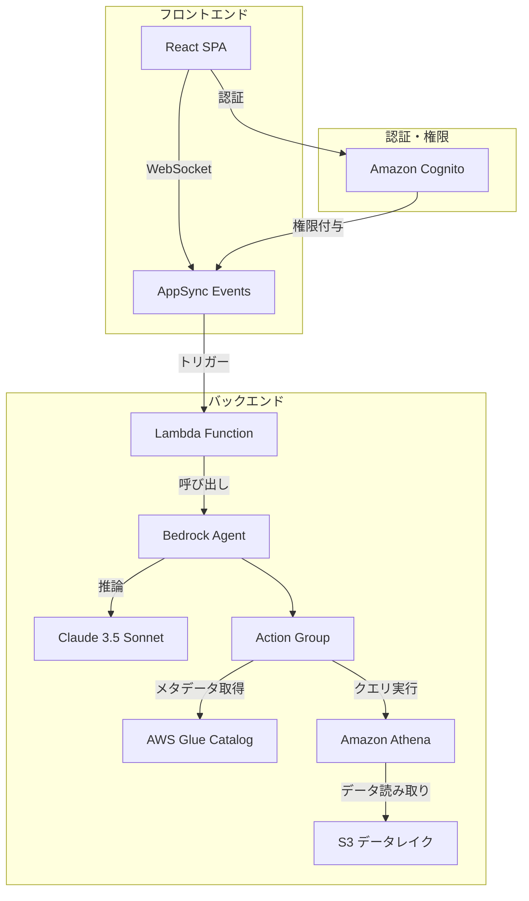
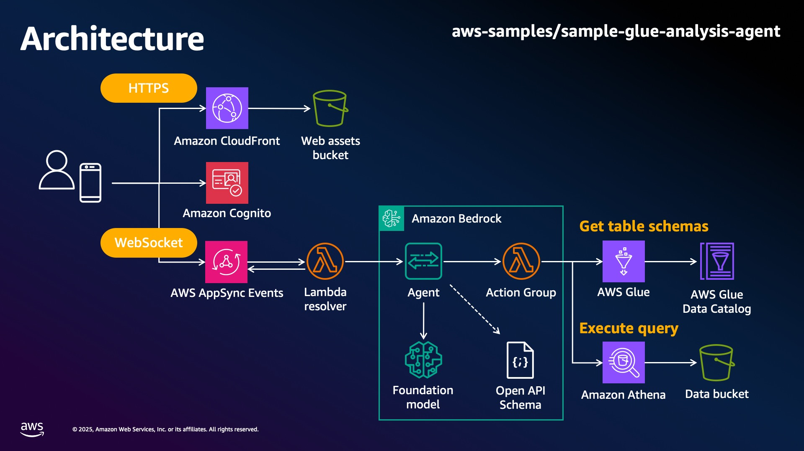
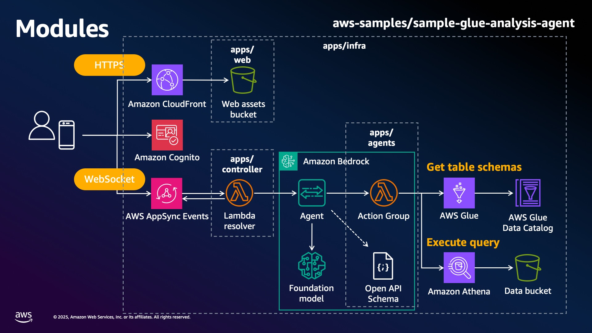

# Sales Analysis Agent

Sales Analysis Agent は、Amazon Bedrock Agents を活用した自然言語による売上データ分析チャットアプリケーションです。ユーザーは自然言語で質問するだけで、AWS Glue データカタログに格納された売上データを Amazon Athena を通じて分析し、直感的に理解できる形式で結果を表示します。

## 主な機能

- **自然言語での売上データ分析**
  - 「2021 年の四半期ごとの売上を製品別に分析して」
  - 「2018 年の売上トップ 10 の顧客は？」
  - 「地域別の売上成長率を 2018 年と 2020 年で比較して」
  - 「顧客の業種別にもっとも人気の製品を教えて」
  - 「割引率と利益の相関関係を示して」
- **インタラクティブなデータ可視化**
  - 分析結果のグラフ・チャート表示
  - データの傾向やパターンの視覚化
  - カスタマイズ可能な可視化オプション
- **対話型フォローアップ分析**
  - 「その中でも特に成長率の高いカテゴリは？」
  - 「このトレンドの理由を分析して」などの会話の流れでの詳細分析
- **Amazon Cognito 認証**
  - ユーザー認証によるセキュアなアクセス
  - Cognito Managed Login による簡単なログイン体験

## アーキテクチャ概要







## デプロイとテストデータの準備

### 前提条件

- AWS アカウント
- AWS CLI のセットアップと設定済み
- 管理者権限を持つ IAM ユーザーまたはロール
- Node.js 22
- Python 3.13
- uv
- pnpm

### 依存関係のインストール

```sh
pnpm install --frozen-lockfile
```

### UserPoolDomainPrefix の変更
UserPoolDomainPrefix は Cognito に使用される設定で、グローバルに一意の文字列である必要があります。

`apps/infra/parameter.ts` をエディタで開いて

```
  userPoolDomainPrefix: "sales-analysis-chat-api-konoken",
```

を他のユーザーと被らない文字列に変更します。

### インフラのデプロイ

```bash
# CDKブートストラップ（初回のみ）
cd apps/infra
pnpm exec cdk bootstrap

# インフラデプロイ
pnpm exec cdk deploy --all
```

### テストデータのアップロード

デプロイ完了後、テストデータを S3 バケットにアップロードするには：

```bash
node scripts/upload-data.js
```

このスクリプトは、CloudFormation の Outputs から S3 バケット名を取得し、`testdata/order.csv`を Glue テーブルの対応する S3 パスにアップロードします。

## 使用方法

### アクセス方法

アプリケーションはデプロイ時に表示された URL でアクセスできます。

```
Dev-GlueSalesAnalysisAgent.WebAppUrl = https://****.cloudfront.net
```

### 認証

デフォルトではセルフサインアップが有効になっており、ユーザーは自由にアカウントを作成してログインすることができます。

セルフサインアップを無効にするには　`apps/infra/parameter.ts` を開き、以下の項目を `false` にして再度 `pnpm exec cdk deploy --all` を実行します。

```
  selfSignUpEnabled: true,
```


## ドキュメント

- README.md ... ユーザー向けに、プロジェクトの概要、機能、開始方法を記述します
- CONTRIBUTING.md ... コントリビューター向けに、開発環境の構築方法、ローカルでの実行およびデバッグ方法、テストの実行方法と要件、プルリクエストの出し方、その他規約を記述します

## サポートとフィードバック

- **バグ報告**: GitHub Issues で報告してください
- **機能リクエスト**: GitHub Discussions で提案してください

## ライセンス

このプロジェクトは MIT ライセンスの下で公開されています。詳細は LICENSE ファイルを参照してください。

## 開発に参加する

プロジェクトの開発に参加したい方は、[CONTRIBUTING.md](./CONTRIBUTING.md)を参照してください。
